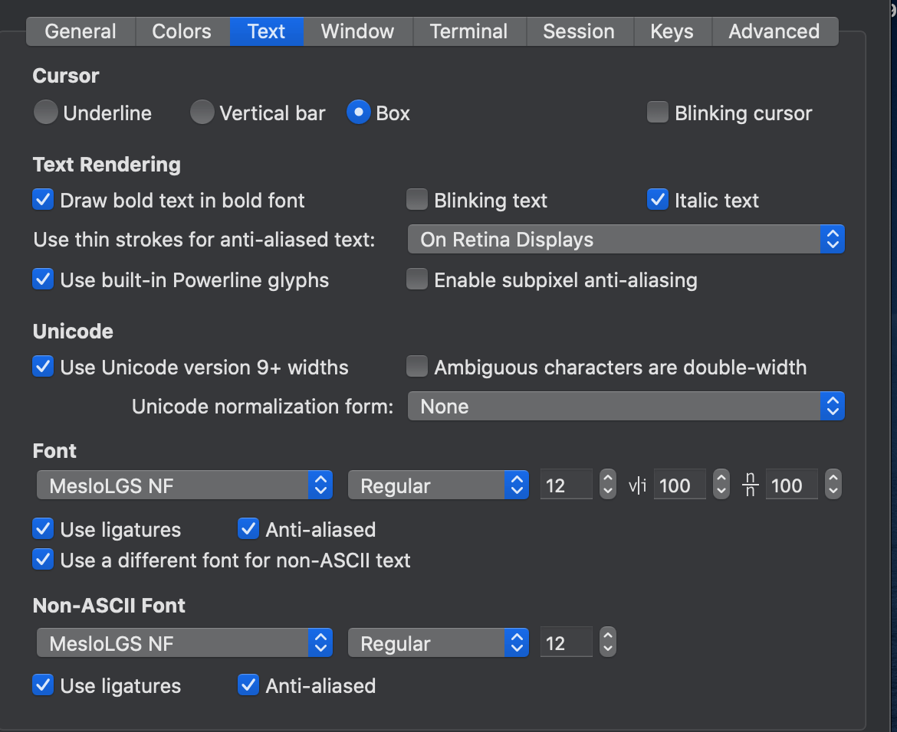
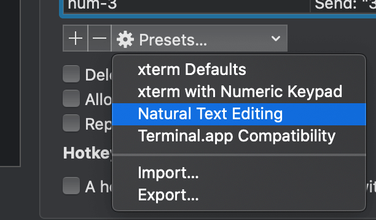
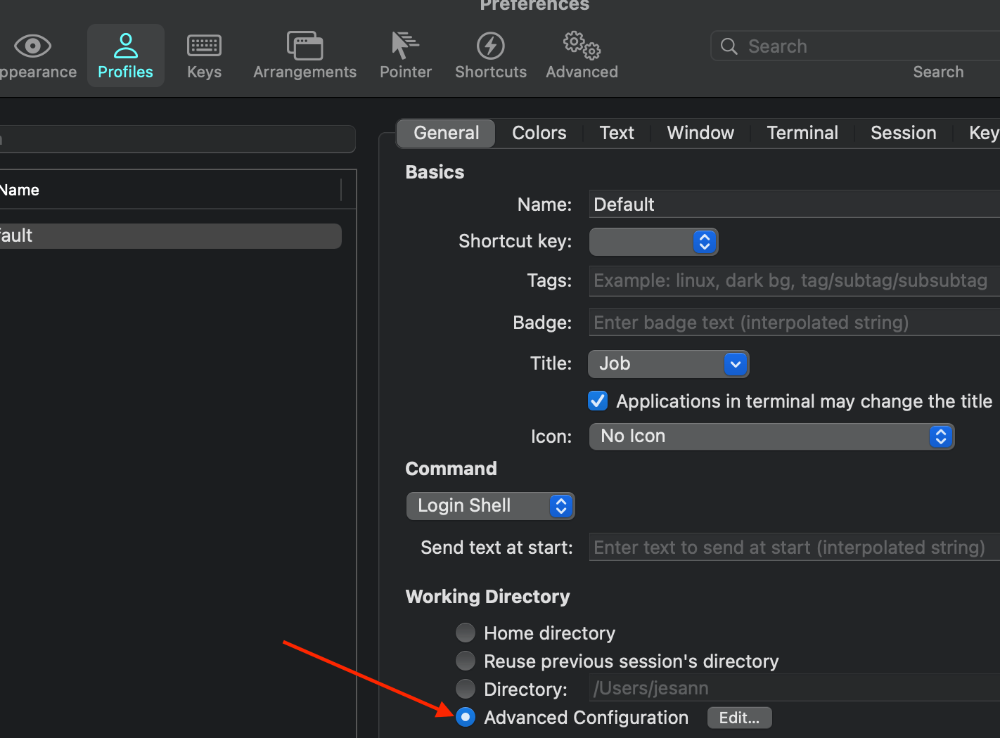

# OSX_install

Shell script of installing my necessary stuff.

**Feel free to clone and make up your own version** 😊

```bash
git clone git@github.com:anneback/revive.git
```

# Run script

```bash
cd ~/dev/revive
./osx_install_work.sh
```

# Stuff to do after running script

## iTerm

1. FONTS: Preferences > Profiles > Text

   1. Add Font `MesloLGS NF`
   2. Check `Use ligatures`



1. NAVIGATION: Preferences > Profiles > Keys
   1. Under ☸Presets... choose `Natural Text Editing`



2. ITERM NEW WINDOWS/TABS/PANES: Preferences > Profiles

   1. Under **Working directory** check `Advanced Configuration` and press `Edit`

      

   2. Check in the behaviour you like

      

## Editor

1. `cmd + shift + p` search `SHELL`

   ```
   Shell Command: Install 'code' command in PATH
   ```

2. Plugins

- change-case
- Error Lens
- ESLint
- GitLens
- Import Cost
- Material Icon Theme
- One Dark Pro
- Prettier
- Prettify JSON
- Syntax Highlighting for yarn.lock
- TODO highlight
- vscode-styled-components

## Creds to

- [sainnhe](https://github.com/sainnhe) for vim theme `sonokai`
- [zshusers](https://github.com/zsh-users) for `zsh-syntax-highlighting`
- [romkatv](https://github.com/romkatv/) for zsh theme `Powerline10k` and `MesloLGS NF` fonts
