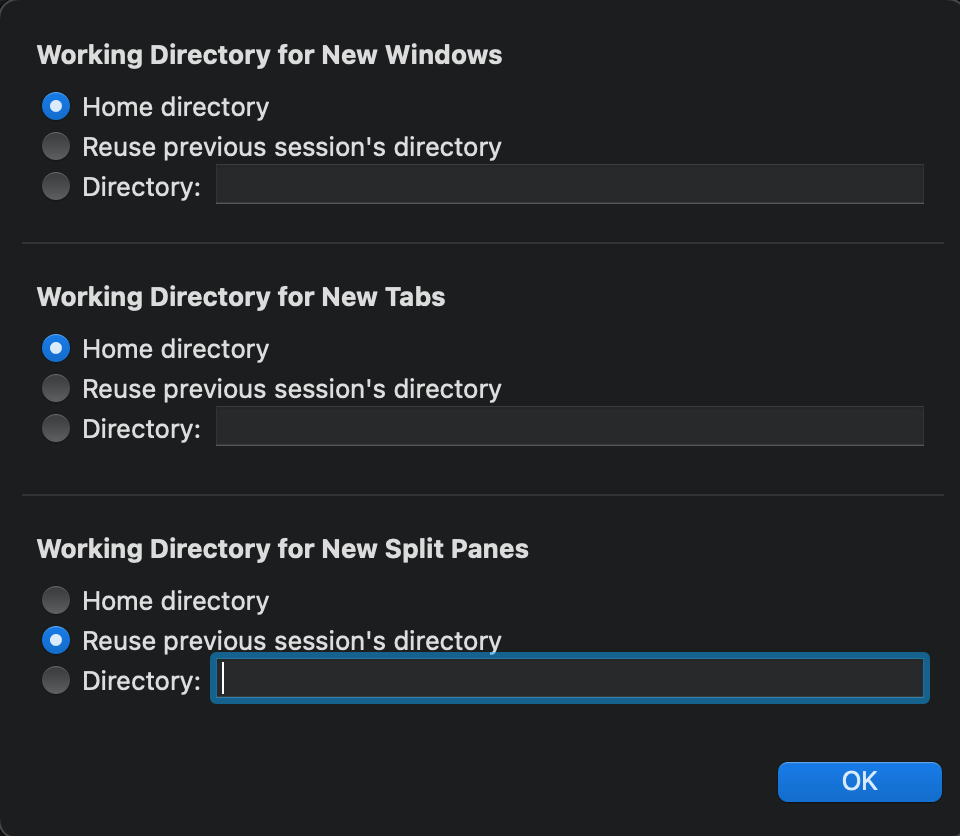

# OSX_install

Shell script of installing my necessary stuff.

**Feel free to clone and make up your own version, and also feel free to credit me in your README.md** 😊

# Run script

```
> ./osx_install.sh
```

or for the work setup

```
> ./osx_install_work.sh
```

# Stuff to do after running script

## iTerm

1. FONTS: Preferences > Profiles > Text

   1. Add Font `MesloLGS NF`
   2. Check `Use ligatures`


1. NAVIGATION: Preferences > Profiles > Keys
   1. Under ☸Presets... choose `Natural Text Editing`


3. ITERM NEW WINDOWS/TABS/PANES: Preferences > Profiles

   1. Under **Working directory** check `Advanced Configuration` and press `Edit`

      

   2. Check in the behaviour you like

      

## VSCode

1. `cmd + shift + p` search `SHELL`


2. Plugins

- Atom One Dark Theme
- change-case
- ESList
- Material Icon Theme
- Prettier

## Creds to

- [sainnhe](https://github.com/sainnhe) for vim theme `sonokai`
- [zshusers](https://github.com/zsh-users) for `zsh-syntax-highlighting`
- [romkatv](https://github.com/romkatv/) for zsh theme `Powerline10k` and `MesloLGS NF` fonts
